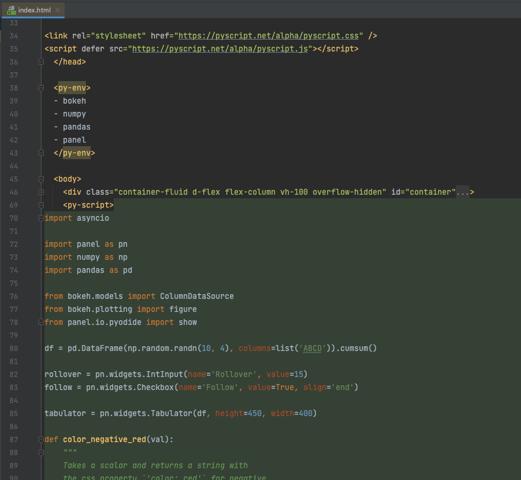

# PyScript PyCharm Plugin

<!-- Plugin description -->
PyCharm plugin for [PyScript](https://pyscript.net/).
<!-- Plugin description end -->

## ScreenShots

## Sponsors

## Contribute
We are waiting for your contributions to `pyscript-pycharm-plugin`.

## This project is currently in an experimental phase
